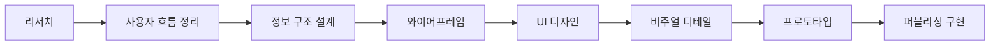
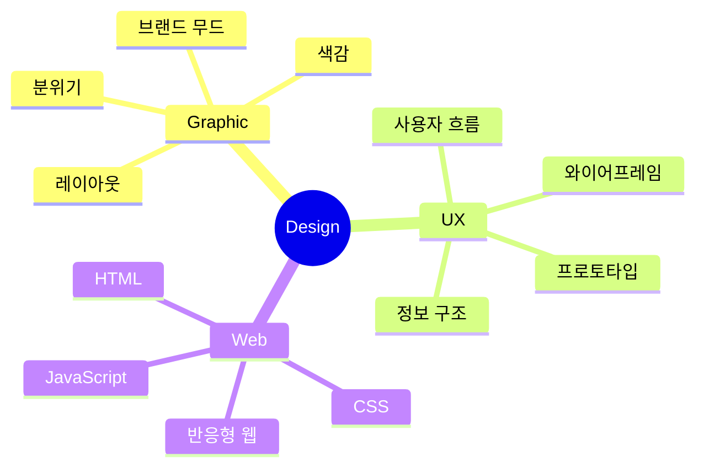

# 💻 보기 편하고 깔끔한 디자인을 하는 웹 디자이너 송현빈입니다

그래픽디자인 감성을 바탕으로
브랜드의 분위기와 시각적인 완성도를 중요하게 생각하는 웹디자이너 지원자입니다.

단순히 화면을 꾸미는 것을 넘어,
사용자가 보기 편하고 자연스럽게 흐름을 이해할 수 있는 인터페이스를 고민하며 디자인합니다.

`Web Design` · `UI Design` · `Graphic Design` · `Figma` · `Responsive Web` · `HTML` · `CSS` · `JavaScript`

---

## 소개

| 구분 | 내용 |
|---|---|
| 디자인 분야 | 웹디자인, UI 디자인, 그래픽디자인, 배너디자인, 상세페이지 |
| 강점 | 색감, 레이아웃, 분위기를 활용한 비주얼 디자인 |
| UX 설계 | 사용자 흐름, 정보 구조, 와이어프레임, 프로토타입 |
| 웹 이해도 | HTML, CSS, 기초 JavaScript, 반응형 웹 |
| 관심 분야 | 웹디자인, 그래픽디자인, 일러스트레이션, 인터랙션, 퍼블리싱 |

---

## 디자인 방향성

| 영역 | 설명 |
|---|---|
| Graphic Design | 브랜드 분위기와 감성을 시각적으로 표현하는 작업을 좋아합니다. |
| Web Design | 보기 편하면서도 분위기가 전달되는 웹 화면을 디자인합니다. |
| UI Design | 사용자가 자연스럽게 흐름을 이해할 수 있는 인터페이스를 고민합니다. |
| Publishing | 디자인이 실제 웹 화면에서 구현되는 과정까지 함께 고려합니다. |

---

## 사용 도구와 기술

### Design

### Web

### Tools

---

## 포트폴리오 프로젝트

| 프로젝트 | 유형 | 주요 작업 |
|---|---|---|
| 그래픽 작업 | Graphic Design | 배너, 브랜드 비주얼, SNS 콘텐츠 디자인 | <a href="https://shb627.github.io/shb-portfolio/" target="_blank">📁 [Portfolio]</a> | 
| 웹 리디자인 프로젝트 | Web Design | 메인/서브 페이지 디자인 및 반응형 웹 구성 | <a href="https://shb627.github.io/redesign-project/" target="_blank">📁 [행복북구문화재단]</a> | 
| 서비스 디자인 | Service Design | 위치 기반 감정 기록 서비스 UX/UI 디자인 | <a href="https://shb627.github.io/mood-here/home.html" target="_blank">📁 [무드 히어]</a> | 

<a href="https://shb627.github.io/shb-portfolio/" target="_blank">📁 [Portfolio]</a>

<a href="https://wonderful-radon-c80.notion.site/35f7c08643ad80d59e96e464e875c76a?source=copy_link" target="_blank">📁 [Notion]</a>

## 작업 프로세스

---

## 디자인 사고 구조

